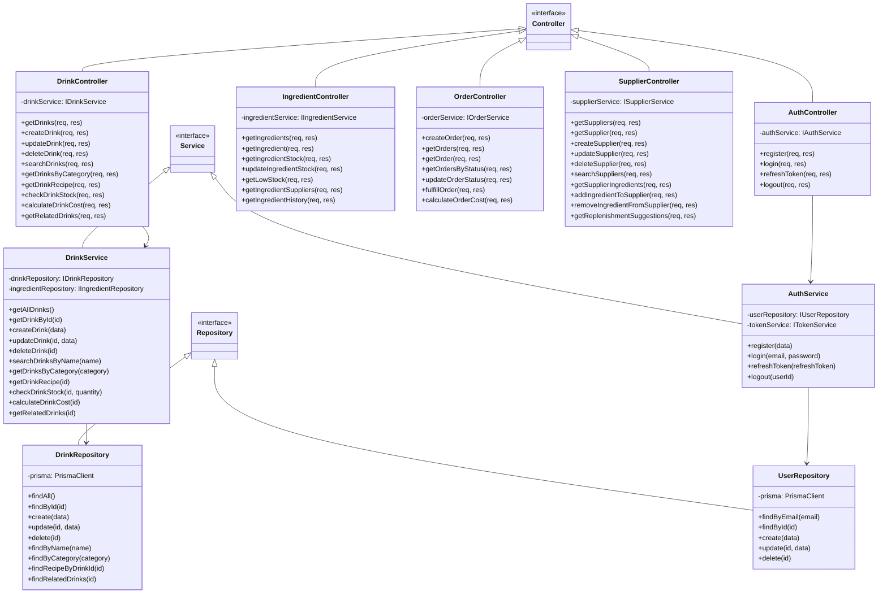

```mermaid
classDiagram
    class Controller {
        <<interface>>
    }
    
    class DrinkController {
        -drinkService: IDrinkService
        +getDrinks(req, res)
        +createDrink(req, res)
        +updateDrink(req, res)
        +deleteDrink(req, res)
        +searchDrinks(req, res)
        +getDrinksByCategory(req, res)
        +getDrinkRecipe(req, res)
        +checkDrinkStock(req, res)
        +calculateDrinkCost(req, res)
        +getRelatedDrinks(req, res)
    }
    
    class AuthController {
        -authService: IAuthService
        +register(req, res)
        +login(req, res)
        +refreshToken(req, res)
        +logout(req, res)
    }
    
    class IngredientController {
        -ingredientService: IIngredientService
        +getIngredients(req, res)
        +getIngredient(req, res)
        +getIngredientStock(req, res)
        +updateIngredientStock(req, res)
        +getLowStock(req, res)
        +getIngredientSuppliers(req, res)
        +getIngredientHistory(req, res)
    }
    
    class OrderController {
        -orderService: IOrderService
        +createOrder(req, res)
        +getOrders(req, res)
        +getOrder(req, res)
        +getOrdersByStatus(req, res)
        +updateOrderStatus(req, res)
        +fulfillOrder(req, res)
        +calculateOrderCost(req, res)
    }
    
    class SupplierController {
        -supplierService: ISupplierService
        +getSuppliers(req, res)
        +getSupplier(req, res)
        +createSupplier(req, res)
        +updateSupplier(req, res)
        +deleteSupplier(req, res)
        +searchSuppliers(req, res)
        +getSupplierIngredients(req, res)
        +addIngredientToSupplier(req, res)
        +removeIngredientFromSupplier(req, res)
        +getReplenishmentSuggestions(req, res)
    }
    
    class Service {
        <<interface>>
    }
    
    class DrinkService {
        -drinkRepository: IDrinkRepository
        -ingredientRepository: IIngredientRepository
        +getAllDrinks()
        +getDrinkById(id)
        +createDrink(data)
        +updateDrink(id, data)
        +deleteDrink(id)
        +searchDrinksByName(name)
        +getDrinksByCategory(category)
        +getDrinkRecipe(id)
        +checkDrinkStock(id, quantity)
        +calculateDrinkCost(id)
        +getRelatedDrinks(id)
    }
    
    class AuthService {
        -userRepository: IUserRepository
        -tokenService: ITokenService
        +register(data)
        +login(email, password)
        +refreshToken(refreshToken)
        +logout(userId)
    }
    
    class Repository {
        <<interface>>
    }
    
    class DrinkRepository {
        -prisma: PrismaClient
        +findAll()
        +findById(id)
        +create(data)
        +update(id, data)
        +delete(id)
        +findByName(name)
        +findByCategory(category)
        +findRecipeByDrinkId(id)
        +findRelatedDrinks(id)
    }
    
    class UserRepository {
        -prisma: PrismaClient
        +findByEmail(email)
        +findById(id)
        +create(data)
        +update(id, data)
        +delete(id)
    }
    
    Controller <|-- DrinkController
    Controller <|-- AuthController
    Controller <|-- IngredientController
    Controller <|-- OrderController
    Controller <|-- SupplierController
    
    Service <|-- DrinkService
    Service <|-- AuthService
    
    Repository <|-- DrinkRepository
    Repository <|-- UserRepository
    
    DrinkController --> DrinkService
    AuthController --> AuthService
    DrinkService --> DrinkRepository
    AuthService --> UserRepository
```
